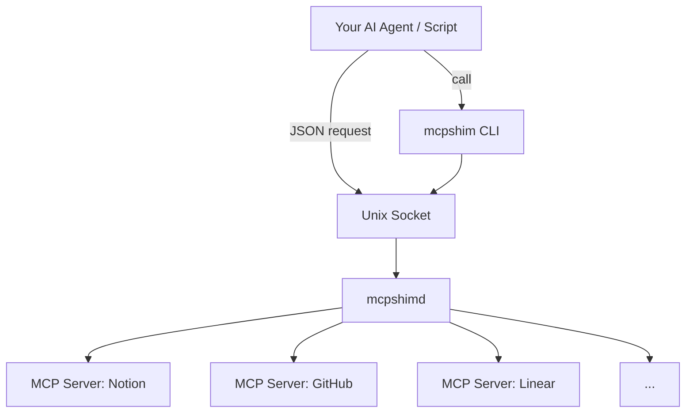

<p align="center">
	
</p>

<h1 align="center">mcpshim</h1>

<p align="center">
	<strong>Turn remote MCP servers into local command workflows.</strong><br/>
	A lightweight daemon + CLI bridge that centralizes MCP sessions, auth, discovery, and tool execution behind one local Unix socket.
</p>

<p align="center">
	<a href="https://mcpshim.dev">Website</a> · <a href="https://github.com/mcpshim/mcpshim">Repository</a> · <a href="#quick-start">Quick Start</a> · <a href="#core-commands">Core Commands</a>
</p>

---

## The Problem

Remote MCP servers are powerful, but each service has its own auth flow, transport expectations, and invocation patterns. Wiring all of that directly into every script or agent loop creates brittle command workflows.

For LLM agents, there is also context pressure: dumping raw MCP schemas for every connected server can consume prompt budget before useful work begins.

## The Solution

`mcpshimd` handles MCP lifecycle concerns in one place: session management, discovery, retries, and OAuth flow.

`mcpshim` provides a stable CLI surface over a local Unix socket so tools can be called consistently, with dynamic flags translated to MCP arguments at runtime.



## Why mcpshim

|                          | Without mcpshim               | With mcpshim                        |
| ------------------------ | ----------------------------- | ----------------------------------- |
| **MCP integration**      | Custom per-server wiring      | One daemon + one CLI                |
| **Auth handling**        | Per-script OAuth/header logic | Centralized in `mcpshimd`           |
| **Tool invocation**      | Provider-specific conventions | `mcpshim call --server --tool ...`  |
| **Agent context budget** | Large MCP schemas in prompt   | Alias-based local command workflows |
| **Operational history**  | Ad-hoc logging                | Built-in call history in SQLite     |

---

## Architecture

| Component  | Role                                                              |
| ---------- | ----------------------------------------------------------------- |
| `mcpshimd` | Local daemon for MCP registry, sessions, auth, retries, and IPC   |
| `mcpshim`  | CLI client for config, discovery, tool calls, history, and script |

All client calls go through a Unix socket and JSON request/response protocol.

## Source Layout

```
cmd/
	mcpshimd/             # Daemon entry point
	mcpshim/              # CLI entry point
configs/
	mcpshim.example.yaml  # Example configuration
internal/
	client/               # CLI command handling and IPC client logic
	config/               # Config loading and defaults
	mcp/                  # MCP transport + OAuth handling
	protocol/             # Request/response protocol types
	server/               # Daemon runtime and routing
	store/                # SQLite persistence
```

## Quick Start

### 1. Install from source

```bash
go install github.com/mcpshim/mcpshim/cmd/mcpshimd@latest
go install github.com/mcpshim/mcpshim/cmd/mcpshim@latest
```

### 2. Configure

```bash
mkdir -p ~/.config/mcpshim
cp configs/mcpshim.example.yaml ~/.config/mcpshim/config.yaml
```

### 3. Start daemon and inspect

```bash
mcpshimd
mcpshim status
mcpshim servers
mcpshim tools
```

### Path Defaults

| Resource | Default Location                    | Override                        |
| -------- | ----------------------------------- | ------------------------------- |
| Config   | `~/.config/mcpshim/config.yaml`     | `--config`, `$MCPSHIM_CONFIG`   |
| Socket   | `$XDG_RUNTIME_DIR/mcpshim.sock`     | `mcpshimd --socket ...`         |
| Database | `~/.local/share/mcpshim/mcpshim.db` | `server.db_path` in YAML config |

All paths follow XDG defaults where applicable.

### Daemon flags

| Flag        | Description               |
| ----------- | ------------------------- |
| `--config`  | Path to config YAML       |
| `--socket`  | Override unix socket path |
| `--debug`   | Enable debug logging      |
| `--version` | Print version and exit    |

---

## Core Commands

| Command                                               | Description                      |
| ----------------------------------------------------- | -------------------------------- |
| `mcpshim servers`                                     | List registered MCP servers      |
| `mcpshim tools [--server name] [--full]`              | List tools for all or one server |
| `mcpshim inspect --server s --tool t`                 | Show tool schema/details         |
| `mcpshim call --server s --tool t --arg value`        | Execute a tool call              |
| `mcpshim add --name s --url ... [--alias a]`          | Register a new MCP endpoint      |
| `mcpshim set auth --server s --header K=V`            | Set auth headers for a server    |
| `mcpshim remove --name s`                             | Remove a registered server       |
| `mcpshim reload`                                      | Reload daemon configuration      |
| `mcpshim validate [--config path]`                    | Validate config file             |
| `mcpshim login --server s [--manual]`                 | Complete OAuth login flow        |
| `mcpshim history [--server s] [--tool t] [--limit n]` | Show persisted call history      |
| `mcpshim script [--install] [--dir ~/.local/bin]`     | Generate/install alias wrappers  |

### Register MCP servers

```bash
mcpshim add --name notion --alias notion --transport http --url https://example.com/mcp
mcpshim set auth --server notion --header "Authorization=Bearer $NOTION_MCP_TOKEN"
mcpshim reload
```

### Dynamic flags

Tool flags are converted automatically to MCP arguments:

```bash
mcpshim call --server notion --tool search --query "projects" --limit 10 --archived false
```

> Tip: JSON output is automatic when stdout is not a terminal. Use `--json` to force JSON parsing behavior in interactive sessions.

---

## OAuth Flow

For OAuth-capable MCP servers, you can configure URL-only registration:

```bash
mcpshim add --name notion --alias notion --transport http --url https://mcp.notion.com/mcp
```

When a request receives `401` and no `Authorization` header is configured, `mcpshimd` can initiate OAuth login, store tokens in SQLite (`oauth_tokens`), and retry automatically.

You can also pre-authorize:

```bash
mcpshim login --server notion
mcpshim login --server notion --manual
```

`--manual` supports cross-device auth by printing a URL and accepting pasted callback URL/code.

---

## Call History

Every `mcpshim call` is recorded by `mcpshimd` with timestamp, server/tool, args, status, and duration.

```bash
mcpshim history
mcpshim history --server notion --limit 20
mcpshim history --server notion --tool search --limit 100
```

History is stored locally in SQLite (`call_history` table).

---

## IPC Protocol

`mcpshim` communicates with `mcpshimd` over a Unix socket using JSON messages with an `action` field.

```json
{"action":"status"}
{"action":"servers"}
{"action":"tools","server":"notion"}
{"action":"inspect","server":"notion","tool":"search"}
{"action":"call","server":"notion","tool":"search","args":{"query":"roadmap"}}
{"action":"history","server":"notion","limit":20}
{"action":"add_server","name":"notion","alias":"notion","url":"https://mcp.notion.com/mcp","transport":"http"}
{"action":"set_auth","name":"notion","headers":{"Authorization":"Bearer ..."}}
{"action":"reload"}
```

---

## Lightweight Aliases

Generate shell functions:

```bash
eval "$(mcpshim script)"
notion search --query "projects" --limit 10
```

Install executable wrappers instead:

```bash
mcpshim script --install --dir ~/.local/bin
notion search --query "projects" --limit 10
```
